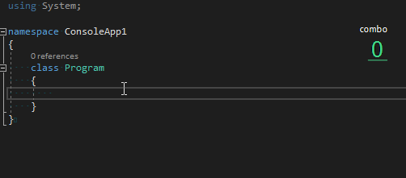



# PowerMode
This is the Power Mode extension for Visual Studio to replicate the effects from [codeinthedark/editor](https://github.com/codeinthedark/editor).

Inspired by the Power Mode Extension for Atom, which can be found [here](https://atom.io/packages/activate-power-mode).

# Effects

# Installation
Now the extension can be found at [Visual Studio Gallery](https://marketplace.visualstudio.com/items?itemName=BigEgg.PowerMode).

Also, you can always download the source code and build the VSIX file by yourself.

# User Guide
Can go to [GitHub Page](https://bigeggtools.github.io/PowerMode/) to find more information.

# Features
In current version, contains the following features:

* Visual Studio menu to toggle the features. (See [Detail](https://bigeggtools.github.io/PowerMode/menu/))
  + Hotkey Binding
* User Friendly Visual Studio Option. (See [Detail](https://bigeggtools.github.io/PowerMode/options/))
* Combo Mode. (See [Detail](https://bigeggtools.github.io/PowerMode/combomode/))
* Streak Counter. (See [Detail](https://bigeggtools.github.io/PowerMode/streakcounter/))
  + Max Combo Streak.
  + Support Light Background.
* Particles. (See [Detail](https://bigeggtools.github.io/PowerMode/particles/))
  + Party Mode.
* Screen Shake. (See [Detail](https://bigeggtools.github.io/PowerMode/screenshake/))
* Excluded File Types. (See [Detail](https://bigeggtools.github.io/PowerMode/options/general/))

# Visual Studio Supports
* Now support the following versions
  + Visual Studio 2017
  + Visual Studio 2019

# Next Features
The next version of this extension will have the following features:

* Play Audio Clip (middle priority)
  + Clip can be: Gun, Typewriter or Custom
  + Related Options and Menu
