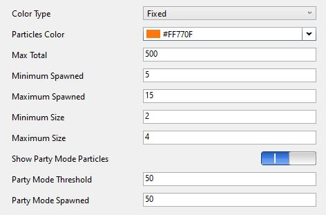

The Power Mode extension have Visual Studio option pages to config features.

To see other option pages please click links below.
* [General](../general)
* [Combo Mode](../combomode)
* **Particles**
* [Screen Shake](../screenshake)

## Particles Option

The "Particles" page have all the settings related with the Particles.

**Note:**

> When *Combo Mode* is enabled, effects, *Particles*, won't appear until reach the activation threshold.

### **Color Type** Selector

The color type of particles. Have 3 values:
* **Random**: use random color for each particle
* **Cursor**: use current cursor color for particles 
* **Fixed**: use a fixed color for particles

Default is *Random*.

### **Particles Color** Color Picker

The fixed color of particles.

Only when "Color Type" Selector choose "Fixed", this field can be edit.

### **Max Total** Textbox

The maximum total number of particles can be shown on the screen. Should be 1 - 2000.

> When number in **Max Total** Textbox larger than 1000, there might have some performance issue.

### **Minimum Spawned** Textbox

The minimum (randomized) number of particles spawned on input. Should be 1 - 50. Also should less than number of **Maximum Spawned** Textbox.

### **Maximum Spawned** Textbox

The maximum (randomized) number of particles spawned on input. Should be 1 - 50.

### **Minimum Size** Textbox

The minimum (randomized) size of the particles. Should be 1 - 50. Also should less than number of **Maximum Size** Textbox.

### **Maximum Size** Textbox

The maximum (randomized) size of the particles. Should be 1 - 50.
