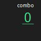

When *Combo Mode* is enabled, by default the *Streak Counter* will shows.

## **Show** & **Hide** Streak Counter
To show or hide the *Streak Counter*:
* Use **Show Streak Counter** toggle button in [Combo Mode Option Page](../options/combomode/).

**Note:**

> When *Combo Mode* is disabled, *Streak Counter* won't show up.

## Colors
Streak Counter can show different color while combo level's change.

## Exclamation
Exclamation can shows when every certain number of key streak happened.
